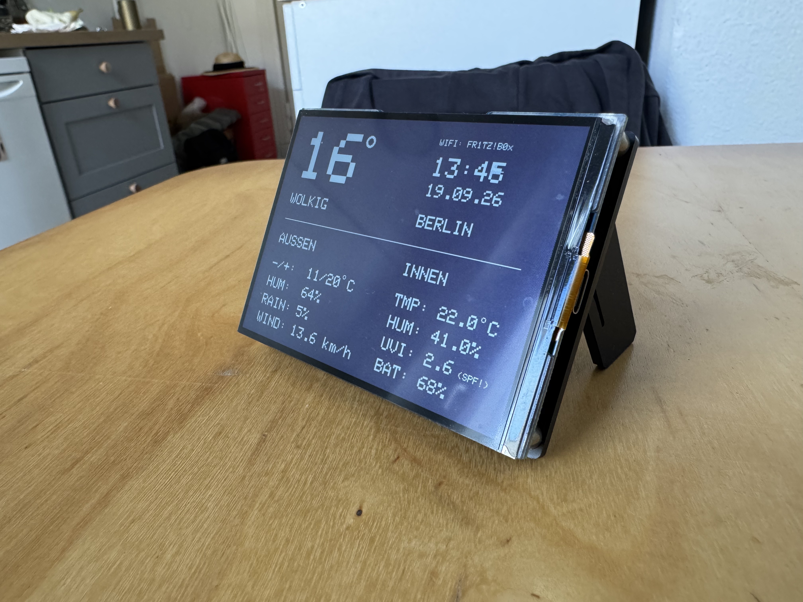
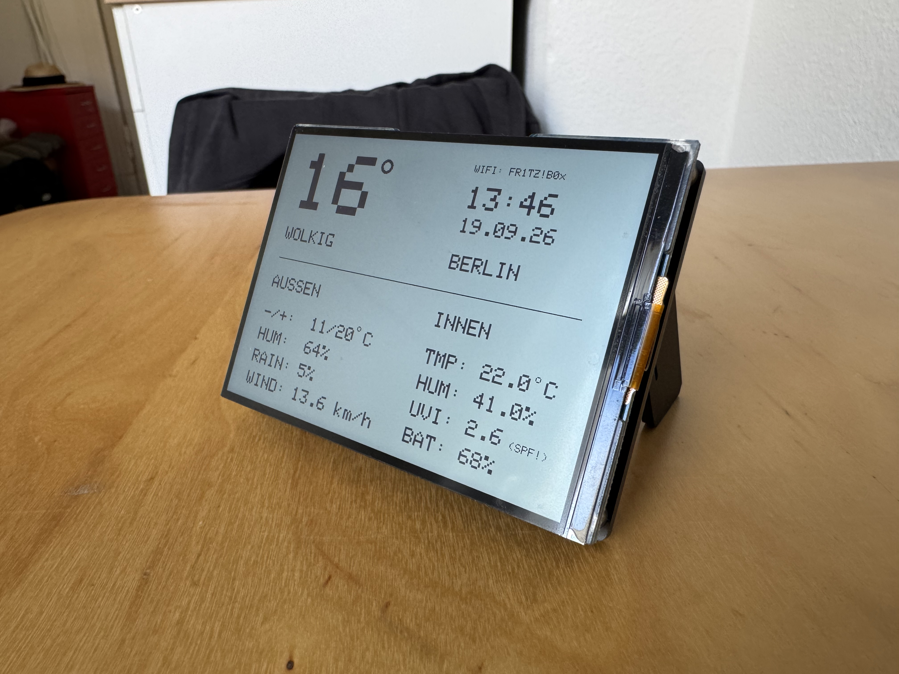

# RLCD Weather Station

An ESP32-S3-based weather and room climate dashboard on a Waveshare 4.2" RLCD, showing current outdoor weather data and indoor sensor readings.

 

## Motivation

This project came from the wish to build an energy-efficient, always-on info display for my desk that shows weather, time, and room climate at a glance, without having to wake up a smartphone or PC. I deliberately chose the RLCD because, unlike OLED/LCD, it stays readable in direct light and uses significantly less power.

## Tech Stack

- **Hardware:** Waveshare ESP32-S3 RLCD 4.2" (400×300, monochrome), DHT11 (indoor temperature/humidity), LiPo battery (3500mAh)
- **Framework:** Arduino / PlatformIO
- **Libraries:** Adafruit GFX, ArduinoJson, DHT sensor library, WiFiMulti
- **API:** [Open-Meteo](https://open-meteo.com/) for outdoor weather data (current temperature, humidity, precipitation probability, wind, UV index, daily min/max)

## Features

- Live display of outdoor temperature, weather conditions, humidity, precipitation probability, and wind
- Indoor monitoring (temperature, humidity) via DHT11
- NTP-synced time and date
- UV index warning (sun protection notice at UVI ≥ 2.5)
- Battery level display via voltage measurement
- Dark/light mode toggle via button
- Night deep sleep with wake-on-button to save battery
- "Matrix-style" rattling startup animation
- Per-minute display refresh (instead of every second) to save energy

## What I Learned

- How to work with `GFXcanvas1` and external displays (no native partial refresh: every frame is a full-screen transfer)
- Deliberately separating "cheap" operations (time queries) from "expensive" operations (display push) to optimize energy consumption
- Working with ESP32 deep sleep, RTC memory (`RTC_DATA_ATTR`), and wakeup causes
- Clean debugging of C++ syntax errors (missing semicolons, typos in assignments vs. comparisons)
- Basics of Git/GitHub workflows via the VS Code UI and the terminal

## Known Limitations

- The remaining runtime estimate is based on an assumed average consumption, not on real current measurement, so its accuracy is limited
- No native partial display refresh possible (hardware limitation of the RLCD display)
- Wi-Fi credentials must be stored locally in `include/secrets.h` (not part of the repo, see `.gitignore`)
