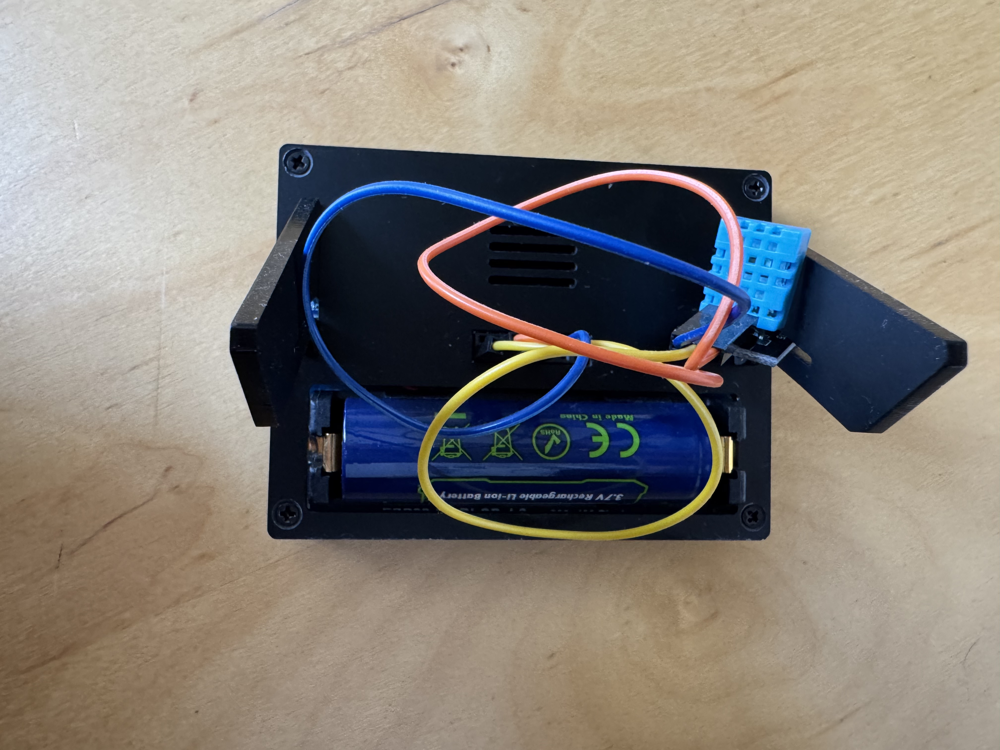

# RLCD Wetterstation

Ein ESP32-S3-basiertes Wetter- und Raumklima-Dashboard auf einem Waveshare 4.2" RLCD, das aktuelle Außenwetterdaten und Innenraum-Sensordaten anzeigt.

  

## Motivation

Das Projekt entstand aus dem Wunsch, ein energieeffizientes, always-on Info-Display für den Schreibtisch zu bauen, das auf einen Blick Wetter, Uhrzeit und Raumklima zeigt – ohne Smartphone oder PC dafür aufwecken zu müssen. Das RLCD wurde bewusst gewählt, da es (anders als OLED/LCD) auch bei direktem Licht gut lesbar ist und deutlich weniger Strom verbraucht.

## Tech Stack

- **Hardware:** Waveshare ESP32-S3 RLCD 4.2" (400×300, monochrom), DHT11 (Innentemperatur/-luftfeuchtigkeit), LiPo-Akku (3500mAh)
- **Framework:** Arduino / PlatformIO
- **Bibliotheken:** Adafruit GFX, ArduinoJson, DHT sensor library, WiFiMulti
- **API:** [Open-Meteo](https://open-meteo.com/) für Außenwetterdaten (aktuelle Temperatur, Luftfeuchtigkeit, Regenwahrscheinlichkeit, Wind, UV-Index, Tagesmin/-max)

## Features

- Live-Anzeige von Außentemperatur, Wetterlage, Luftfeuchtigkeit, Regenwahrscheinlichkeit und Wind
- Innenraum-Monitoring (Temperatur, Luftfeuchtigkeit) über DHT11
- NTP-synchronisierte Uhrzeit und Datum
- UV-Index-Warnung (Sonnenschutz-Hinweis ab UVI ≥ 2.5)
- Batteriestandsanzeige über Spannungsmessung
- Dark-/Light-Mode-Umschaltung per Taster
- Nacht-Deep-Sleep mit Wake-on-Button, um Akku zu sparen
- "Matrix-Style" Rattling-Startanimation
- Minutengenaues Display-Refresh (statt sekündlich) zur Energieeinsparung

## Was ich dabei gelernt habe

- Wie man mit `GFXcanvas1` und externen ays arbeitet (kein natives partielles Refresh – jeder Frame ist ein Vollbild-Transfer)
- Den Unterschied zwischen "billigen" Operationen (Zeitabfrage) und "teuren" Operationen (Display-Push) bewusst zu trennen, um Energieverbrauch gezielt zu optimieren
- Umgang mit ESP32 Deep Sleep, RTC-Speicher (`RTC_DATA_ATTR`) und Wakeup-Ursachen
- Sauberes Debugging von C++-Syntaxfehlern (fehlende Semikolons, Tippfehler in Zuweisungen vs. Vergleichen)
- Grundlagen von Git/GitHub-Workflows über die VS-Code-UI und das Terminal

## Bekannte Einschränkungen

- Die Restlaufzeit-Schätzung basiert auf einem geschätzten Durchschnittsverbrauch, nicht auf einer echten Strommessung – die Genauigkeit ist entsprechend begrenzt
- Kein natives partielles Display-Refresh möglich (Hardware-Limitierung des RLCD Displays)
- WLAN-Zugangsdaten müssen lokal in `include/secrets.h` hinterlegt werden (nicht Teil des Repos, siehe `.gitignore`)
